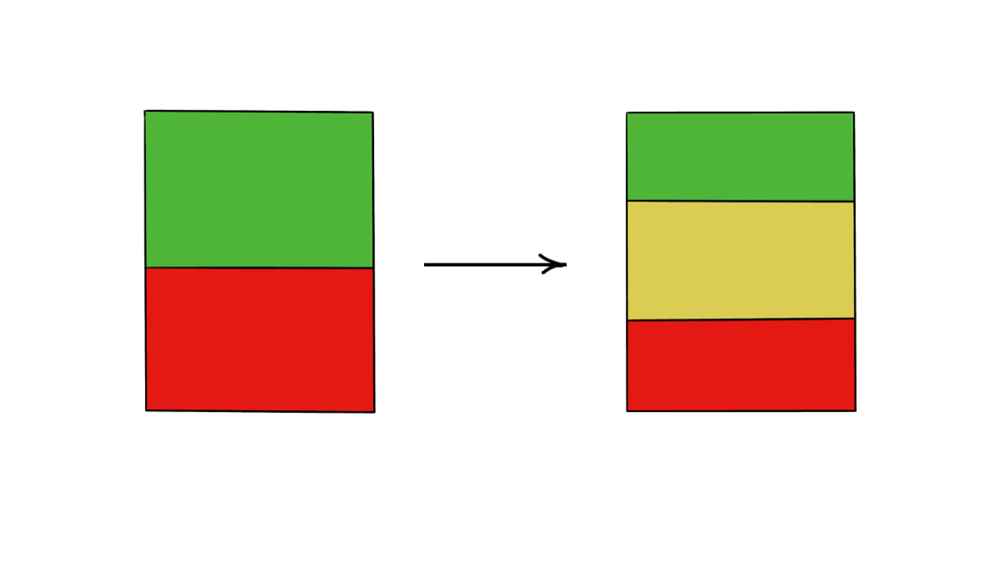
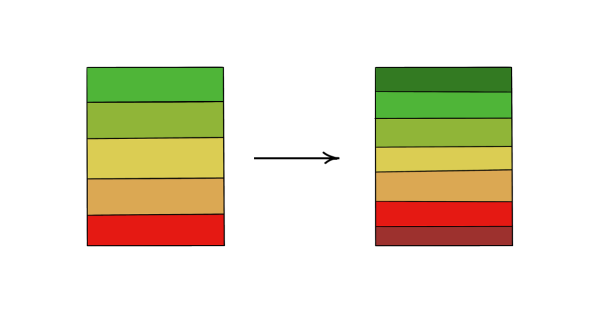
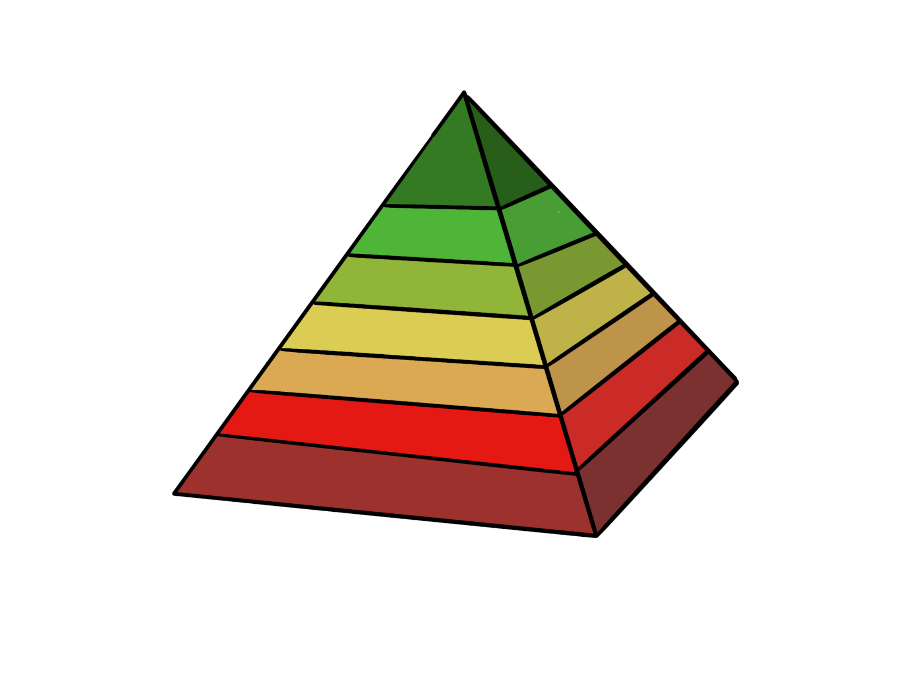

A donkey died in the desert. Some say it died of dehydration, yet it was only a stroll to a watering hole. Others say it died of starvation, yet it was a skip away from a field of greens. The donkey had sufficient energy to reach the water or the field, yet it approached neither.

The donkey died of indecision.

I’ve felt like the donkey in several less tragic situations, large and small. Indecision over a career path led to missed opportunities, vacillation between vacation destinations led to no departure, and noncommittal weekend plans led to driftless days. Caught between paths and not making a choice—even a “bad” choice, even the “wrong” choice—can lead to a far worse outcome than indecision.

### An Unrefined Gut
To avoid the donkey’s fate, we could overcorrect and make rash choices based on intuition. But our intuition—our “gut”—may be insufficiently refined for the choice ahead, leaving us insecure (or, arguably worse, overconfident) with our decision. A business leader may make bold architectural decisions with limited knowledge of the domain or data to support their choice.

Driven by poor outcomes or insecurity, we might turn to highly structured frameworks for prioritization and decision-making. Product management is littered with models like MoSCoW, RICE, Kano, and Weighted Scoring to provide structure and transparent reasoning for business decisions. While these frameworks can be helpful starting points, they can be misused or incomplete for the use case and aren’t practical for complex life decisions like our careers, who to marry, and where to call home.

We enter a dark mire—we know indecision is dangerous, we distrust our gut, but the tools we know aren’t applicable. Thankfully, our beliefs aren’t fixed, so we aren’t doomed to the fate of the indecisive donkey. Just because we distrust our gut today doesn’t mean we can’t develop a trustworthy intuition.

We build our intuition by layering heuristics and preferences formed over time, like a tower constructed brick by brick. To lay these bricks, we can start by understanding our preferences.

### Coloring Preferences
Let’s begin at the most basic, binary level: Yes or No. Red or Green. We can assess preferences by feeling how much positive or negative energy they elicit within us. Without scoffing at the inherent mysticism of that statement, consider a basic example: Do you prefer mountains or beaches? Coffee or tea? These preferences are easy for me: I’m green toward mountains and coffee and red toward beaches and tea.

Small preferences may be simple, but we could extend this to a more meaningful scale, like career categories. Do we like the concept of working in politics, being a doctor, or building a business?

While we may answer some questions using the binary scale, some preferences may remain elusive, and we feel neutral. We can shift to a trinary system, like a traffic light, and assess preferences using red, yellow, and green. We may be green toward business, yellow toward science, and red toward politics.

Then there are things we’re in-between about—things that aren’t entirely yellow, green, or red. We may be neutrally positive or neutrally negative about them, so the color scale evolves into a quinary system: red, orange, yellow, lime, and green.

A five-point scale gives us a broad understanding of our preferences—we prefer X to Y. To use another building metaphor, this initial level of preferential awareness is like carving something from a wood block. We get the rough shape by shaving away some corners and edges, but what we’re carving is still unclear. While most preferences may cluster in the neutral zone, we may have several in green and red. But which rises (or descends) more than the rest? Our scale evolves to burgundy, red, orange, yellow, lime, green, and emerald.

Plotting our preferences on a nuanced scale can help refine our intuition, but the gut instinct this affords isn’t helpful unless we act on it. Returning to a work context: An antipattern I’ve observed on many product backlogs is a proliferation of “P0” items, many emeralds to which the team is partial. They may have rational reasons—removing tech debt is critical, and several opportunities could have positive ROI—but if everything is urgent and essential, nothing is.

### Priority is a Pyramid
I’ve written before about the [bastardization of “priority”](../glass-rubber-cloth) in corporate talk and how it betrays its etymological Latin root of “one.” Likewise, the distribution of our preferences is critical to make them actionable. We cannot have emerald-grade preferences for several things in a domain—roadmap items, career aspirations, partners—often, we can only have one. Our preference scale grows a new dimension.

By the nature of one priority, all other preferences become competitors. One burgundy-grade distaste isn’t enough. Developing an aversion to those other preferences breathes life into the emeralds we’ve selected. Warren Buffet famously kept [two lists](../two-lists) of everything he wanted to do. One short list became his focus, and the second, longer list became his set of anti-priorities to manage against actively so they don’t sabotage list one. Get comfortable with saying no. Push the things that aren’t emerald down the pyramid.