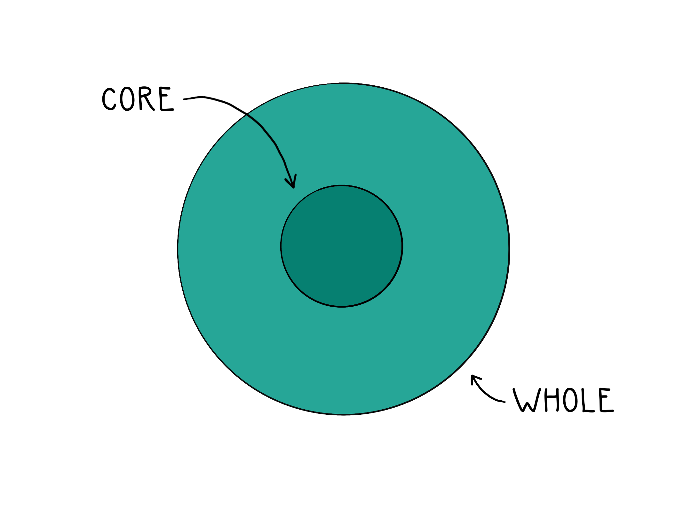

If Thanksgiving were a product, it would have mixed reviews.

Some people love turkey and stuffing. Others hate the heavy food. Some enjoy the parade and football games. Others curse its colonial roots. Some cherish the time with family. Others brace for dinner table arguments. Some treasure the long weekend. Others grumble about chaotic travel. Some appreciate the coming Christmas season. Others bemoan Black Friday.

Thanksgiving garners extreme feelings. When a product draws strong emotion, there’s a signal worth listening to.

### Core Product

During my (surprisingly unchaotic!) travel this weekend, I reflected on one of my early lessons about product management. When building a new technology, understanding the primary value is essential because that key benefit is the **core product**. The core product is often a company’s first and most profitable offering because it defines the essence of the business or—dare I say—the Soul of the Corporation. Oxymoron aside, consider Windows as Microsoft’s core product and Search as Google’s core product. Windows and Search define the public perception of their respective companies and contribute to the lion’s share of revenue.

*Core product = the raw value*

Like Thanksgiving, Microsoft and Google have skewed public perceptions. Some appreciate their “innovative” spirits and rely heavily on their products, but many loathe their near monopolistic control of the tech sector and influence over society. Yet, their core products—Windows and Search—aren’t the source of derision. We are neutral toward the core product but get heated over their parent companies.

### Whole Product

For a product to achieve market success, it must reach mainstream adoption with its target demographic. Geoffrey A. Moore, in his seminal Crossing the Chasm, defines the gap between early adopters and the early majority as the “chasm” that products must cross if they’re going to survive. The key to bridging this gap, states Moore, is offering a **whole product**.

*Whole product = experience surrounding the raw value*

The whole product is everything surrounding the core product: The look & feel, the packaging, the brand image, the customer support, and “end-user harmony.” This intangible stuff can create more power than the core product alone. Apple repeatedly mastered the whole product experience by creating an aesthetic brand in an otherwise nerdy industry. The iPod was a great core product—a state-of-the-art digital music player—but what made it an industry leader was its whole product experience: iTunes. The massive, easy-to-use music library offered legitimate song purchases in a market saturated with shady rippers and torrents; the whole product experience drove Apple’s success in music-playing hardware.

When we think about Thanksgiving, we think about the whole product: the turkey, the travel, the parade, the problematic pilgrims. Google is more than Search; it’s our email service provider, a privacy predator, and a Big Tech overlord. These other things shape our perception and give us pause.

### Total Product

While the core product is the substance—the raw features and value—no one can receive its value without packaging. And no whole product scheme will matter if the core value is missing. The **total product** crosses the chasm to mainstream adoption.

*Total product = the raw value + surrounding experience*

Thanksgiving is as mainstream of a holiday as it gets in the US, so—in that regard—its total product offering is a success. But whatever our opinions on the whole product, we could use the next two days to reflect on its core product. Before the mashed potatoes and Purina dog show, more glaringly apparent than the Black Friday deals or familial microaggressions, the raw value lies in the name itself. The core product of Thanksgiving is gratitude.

Gratitude is something I don’t consider often or deeply enough, and I’m not alone. When normalized to a high quality of life—consistent electricity, accessible heat, clean water, affordable food, personal safety, job security, physical mobility, and reliable transportation—I take these great things for granted. Compared to our ancestors and even (sadly) members of our own cities, it's truly astonishing how provided for most of us are. Thanksgiving is our annual reminder to acknowledge that.

We may not appreciate the whole product, but the core product is worth respecting.